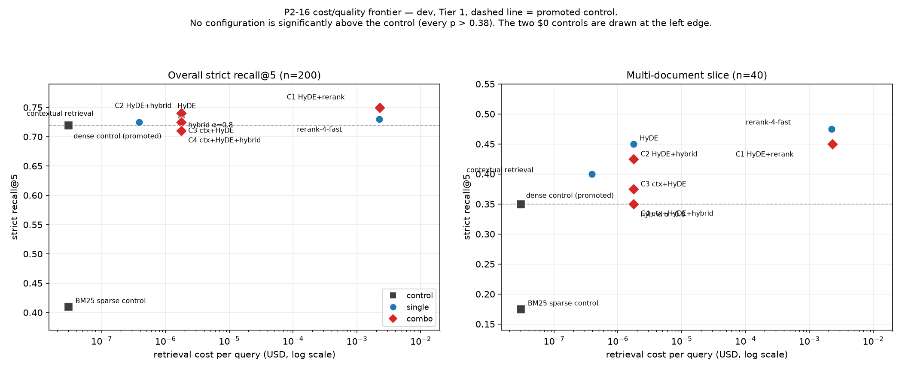

# EXP-0042 to EXP-0045 — The combination set (P2-16)

- **Status:** VALID (four runs)
- **Date:** 2026-09-25 · **Git SHA:** 888d9a7 (`git_dirty=0`)
- **Split:** `dev`, Tier 1, 200 questions · **Compared against:** `promoted` (EXP-0005)
- **Cost:** $0.45835 + $0.00035 × 3 = **$0.4594** against a $0.9762 estimate — the
  estimator counts all 8,218 contextual prefix calls as uncached and every one was cached.
- **Hypotheses:** H-030 (0042), H-031 (0043), H-032 (0044), H-033 (0045)

| | Run ID | Combination |
|---|---|---|
| EXP-0042 | `run_20260925_223023_fbcd` | HyDE + `cohere/rerank-4-fast` |
| EXP-0043 | `run_20260925_223430_553c` | HyDE + hybrid weighted α=0.8 |
| EXP-0044 | `run_20260925_223951_153c` | contextual retrieval + HyDE |
| EXP-0045 | `run_20260925_224144_bebc` | contextual retrieval + HyDE + hybrid α=0.8 |

## Question
P2-16 asks whether the per-axis winners compose. **There are no winners** — six axes
produced one positive result and it is not a retrieval technique (DEC-068). So these four
combine the techniques that were individually **positive but null** on the
multi-document slice, and ask the only question left: do their gains add?

## Results
| Config | R@5 | Δ vs control | p | multi-doc | $/query |
|---|---|---|---|---|---|
| control | 0.7200 | — | — | 0.350 | $0.0000000 |
| **EXP-0042** HyDE + rerank | **0.7500** | **+0.0300** | 0.444 | 0.450 | $0.0022918 |
| EXP-0043 HyDE + hybrid | 0.7400 | +0.0200 | 0.683 | 0.425 | $0.0000018 |
| EXP-0044 ctx + HyDE | 0.7250 | +0.0050 | 1.000 | 0.375 | $0.0000018 |
| EXP-0045 ctx + HyDE + hybrid | 0.7100 | −0.0100 | 0.885 | 0.350 | $0.0000018 |

**EXP-0042's 0.7500 is the highest strict recall@5 recorded in this project** — and at
p = 0.444 it is not a finding. Nothing here is significant.

## The sub-additivity finding — P2-16's primary deliverable
Measured on the 40 multi-document questions, question by question, for EXP-0042:

| | multi-doc solved | rate |
|---|---|---|
| control | 14 / 40 | 0.350 |
| HyDE alone | 18 / 40 | 0.450 |
| `rerank-4-fast` alone | 19 / 40 | 0.475 |
| **additive prediction** | **24 / 40** | **0.600** |
| **combination, measured** | **18 / 40** | **0.450** |

**The combination reaches exactly HyDE's score — below the better of its two
components.** The 0.150 shortfall against the additive prediction decomposes into two
distinct effects, and the second is the more interesting:

1. **Overlap.** HyDE rescues 7 questions the control misses; the reranker rescues 7.
   **Four of those are the same questions.** The union of what either can fix is 10, not
   14 — so even a perfect combination could only have reached 0.600, and the techniques
   were never as independent as their separate scores suggested.
2. **Interference.** The combination solves **8 of those 10** — and **loses 6 questions
   that at least one arm had solved**, including some the plain control got right. Two
   techniques that each improve the ranking do not leave each other's improvements
   intact. Stacking is not free even when it is sub-additive.

**Adding components monotonically degrades the result.** Two components: 0.750, 0.740,
0.725. Three: 0.710, below the control. The three-way stack's multi-doc slice lands at
**exactly 0.350**, the control's value, having passed through three techniques each of
which raised it alone.

## Cost/quality frontier


Tier 1 only, so `$/query` means the same thing at every point: retrieval cost alone, with
no generation or judge. The two $0 controls are drawn at the left edge of the log axis.

**The frontier is nearly flat and nothing is significantly above the control.** The
1,300x price difference between the cheapest and dearest configuration buys +0.030
strict recall@5 at p = 0.444. The only large, real separation on the plot is the one
established in Phase 1 — dense over BM25, 0.720 against 0.410 — and both of those points
cost nothing per query.

## Observations

**The one paid combination is the best-scoring config in the project and still is not
worth buying.** EXP-0042 costs **$0.0022918 per query against the control's
$0.0000000** — the dense control's query embedding rounds to zero at this precision,
and the reranker bills per query forever. For +0.030 at p = 0.444.

**HyDE's contribution survives combination; the reranker's does not.** In EXP-0042 the
multi-doc slice lands on HyDE's number (0.450) rather than the reranker's (0.475) — the
reranker re-orders a candidate set HyDE has already reordered, and adds nothing on top.
That is exactly the mechanism H-030 named in advance: a reranker cannot exceed the recall
of the pool it is handed, and **HyDE's recall@20 is 0.925 against the control's 0.920**,
so it hands over the same pool.

**The three cheap stacks get monotonically worse as components are added**, which is the
cleanest statement of the interaction result. Each component perturbs the ranking the
next one is trying to improve.

## Anomalies
EXP-0043 has the **highest nDCG@10 in the project (0.6819)** while sitting third on
strict recall@5. nDCG rewards getting gold documents high in the list; strict recall@5
requires *all* of them inside five. A configuration can be better at ranking and no
better at the thing being decided on, and this is the clearest instance of that gap here.

## Hypotheses
- **H-030 — confirmed, including the mechanism and the magnitude.** Predicted multi-doc
  "at or below 0.500" against an additive 0.575–0.600; measured **0.450**, and the
  overlap it predicted (the two techniques rescuing the same questions) is measured
  directly at 4 of 7 shared gains. Predicted overall within ±0.03 of 0.735 — measured
  0.750, at the edge of that band.
- **H-031 — wrong, in the direction I flagged.** Predicted EXP-0043 would land **below**
  HyDE alone (0.735) because HyDE hands BM25 a 120-word passage of high-frequency
  corpus vocabulary. It landed **above**, at 0.740. I also wrote that "20% weight on a
  degraded ranking may simply not matter, in which case this reproduces HyDE alone" —
  that is what happened, and it is the branch I called the less likely one.
- **H-032 — confirmed on overall, wrong on the slice.** Predicted multi-doc within ±0.05
  of contextual retrieval alone (0.425): measured **0.375**, a 0.050 miss on the
  boundary. Overall within ±0.03 of HyDE alone: 0.725 against 0.735, correct. The two
  generated-text techniques did overlap as predicted — they simply overlapped
  *destructively* on the multi-doc slice.
- **H-033 — confirmed on both halves.** Overall within ±0.03 of the control: measured
  **0.710**. And no combination reached significance, so the frontier collapses to the
  control exactly as predicted.

## Decision
**Control retained. Nothing promoted. `promoted.yaml` is unchanged.**

## Reproduce
```bash
rag run configs/exp_0042_combo_hyde_rerank.yaml
rag compare promoted run_20260925_223023_fbcd --metric strict_recall@5
```
